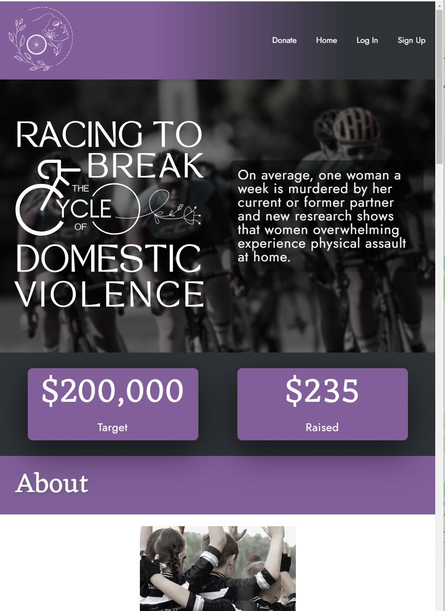
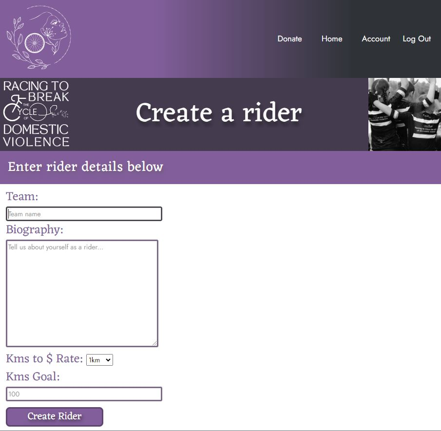
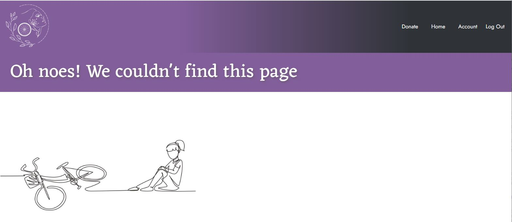

<!-- Improved compatibility of back to top link: See: https://github.com/mayadomi/Best-README-Template/pull/73 -->
<a name="readme-top"></a>
<!--
*** Thanks for checking out the Best-README-Template. If you have a suggestion
*** that would make this better, please fork the repo and create a pull request
*** or simply open an issue with the tag "enhancement".
*** Don't forget to give the project a star!
*** Thanks again! Now go create something AMAZING! :D
-->


<!-- PROJECT SHIELDS -->
<!--
*** I'm using markdown "reference style" links for readability.
*** Reference links are enclosed in brackets [ ] instead of parentheses ( ).
*** See the bottom of this document for the declaration of the reference variables
*** for contributors-url, forks-url, etc. This is an optional, concise syntax you may use.
*** https://www.markdownguide.org/basic-syntax/#reference-style-links
-->
[![Contributors][contributors-shield]][contributors-url]
[![Forks][forks-shield]][forks-url]
[![Stargazers][stars-shield]][stars-url]
[![Issues][issues-shield]][issues-url]
[![MIT License][license-shield]][license-url]
[![LinkedIn][linkedin-shield]][linkedin-url]


<h1 align="center">
  <br>
  <a href="https://breaking-the-cycle.netlify.app/"></a>
  <br>
  Racing to Break the Cycle of Domestic Violence
  <br>
</h1>

<h4 align="center">A first attempt at a React project using <a href="https://vitejs.dev/" target="_blank">Vite</a>.</h4>


<p align="center">
  <a href="#key-features">Key Features</a> •
  <a href="#how-to-use">How To Use</a> •
  <a href="#download">Download</a> •
  <a href="#credits">Credits</a> •
  <a href="#related">Related</a> •
  <a href="#license">License</a>
</p>
<p align="center">
<a href="https://breaking-the-cycle.netlify.app/"></a>
</p>


## Project Deployment

Deployed using [Netlify](https://github.com/mayadomi/desirelines_backend)

Project site [here](https://breaking-the-cycle.netlify.app/)

## Key Features

* Sign-up - Create an account to donate or fundraise a rider
  - Update rider information, user account information
  - Delete your donations.
  - As a rider, post updates of your progress
* Leaderboard of riders 
Sorted by amount raised and showing training progress
  - Filter by rider name

## Wishlist

* Mobile responsiveness
* Better user experience with security handling & authentication
* Improved DRY in CSS
* Improved HMTL/React structure (it's a dogs breakfast)
* Better asset structure/naming
* Accessibilty addressed in elements/structure.

## Back End

Created in DRF, repository [here](https://github.com/mayadomi/desirelines_backend)

## How To Use

To clone and run this application, you'll need [Git](https://git-scm.com) and [Node.js](https://nodejs.org/en/download/) (which comes with [npm](http://npmjs.com)) installed on your computer. From your command line:

```bash
# Clone this repository
$ git clone https://github.com/mayadomi/breakingthecycle-frontend

# Go into the repository
$ cd breakingthecycle-frontend

# Install dependencies
$ npm install

# Run the app
$ npm run dev
```

> **Note**
> If you're using Linux Bash for Windows, [see this guide](https://www.howtogeek.com/261575/how-to-run-graphical-linux-desktop-applications-from-windows-10s-bash-shell/) or use `node` from the command prompt.


## Download

You can [download](https://github.com/amitmerchant1990/electron-markdownify/releases/tag/v1.2.0) the latest installable version of Markdownify for Windows, macOS and Linux.

## Project Submission

- [X] A link to the deployed project
  - [Deployed site](https://)
- [X] A screenshot of the homepage
  - 
- [X] A screenshot of the project creation page
  - 
- [X] A screenshot of the pledge creation form
  - 
- [X] A screenshot of a project with pledges
  - 
- [X] A screenshot of the resulting page when an unauthorized user attempts to edit a project (optional, depending on whether or not this functionality makes sense in your app!)
  - The edit project link is not visible on project page if user is not owner
  - If a user that is not the owner navigates to project update page using the URL, this will redirect to a 404
  - 

<p align="right">(<a href="#readme-top">back to top</a>)</p>

## Credits

This software uses the following open source packages:

- [Node.js](https://nodejs.org/)

## Markdown Credit

[markdownify-web](https://github.com/amitmerchant1990/markdownify-web) - Web version of Markdownify

[OthneilDrew](https://github.com/othneildrew)


<!-- https://www.markdownguide.org/basic-syntax/#reference-style-links -->
[contributors-shield]: https://img.shields.io/github/contributors/mayadomi/breakingthecycle_frontend.svg?style=for-the-badge
[contributors-url]: https://github.com/mayadomi/breakingthecycle_frontend/graphs/contributors
[forks-shield]: https://img.shields.io/github/forks/mayadomi/breakingthecycle_frontend.svg?style=for-the-badge
[forks-url]: https://github.com/mayadomi/breakingthecycle_frontend/network/members
[stars-shield]: https://img.shields.io/github/stars/mayadomi/breakingthecycle_frontend.svg?style=for-the-badge
[stars-url]: https://github.com/mayadomi/breakingthecycle_frontend/stargazers
[issues-shield]: https://img.shields.io/github/issues/mayadomi/breakingthecycle_frontend.svg?style=for-the-badge
[issues-url]: https://github.com/mayadomi/breakingthecycle_frontend/issues
[license-shield]: https://img.shields.io/github/license/mayadomi/breakingthecycle_frontend.svg?style=for-the-badge
[license-url]: https://github.com/mayadomi/breakingthecycle_frontend/blob/master/LICENSE.txt
[linkedin-shield]: https://img.shields.io/badge/-LinkedIn-black.svg?style=for-the-badge&logo=linkedin&colorB=555
[linkedin-url]: https://linkedin.com/in/mayadominice
[product-screenshot]: images/screenshot.png
[Next.js]: https://img.shields.io/badge/next.js-000000?style=for-the-badge&logo=nextdotjs&logoColor=white
[Next-url]: https://nextjs.org/
[React.js]: https://img.shields.io/badge/React-20232A?style=for-the-badge&logo=react&logoColor=61DAFB
[React-url]: https://reactjs.org/
[Vue.js]: https://img.shields.io/badge/Vue.js-35495E?style=for-the-badge&logo=vuedotjs&logoColor=4FC08D
[Vue-url]: https://vuejs.org/
[Angular.io]: https://img.shields.io/badge/Angular-DD0031?style=for-the-badge&logo=angular&logoColor=white
[Angular-url]: https://angular.io/
[Svelte.dev]: https://img.shields.io/badge/Svelte-4A4A55?style=for-the-badge&logo=svelte&logoColor=FF3E00
[Svelte-url]: https://svelte.dev/
[Laravel.com]: https://img.shields.io/badge/Laravel-FF2D20?style=for-the-badge&logo=laravel&logoColor=white
[Laravel-url]: https://laravel.com
[Bootstrap.com]: https://img.shields.io/badge/Bootstrap-563D7C?style=for-the-badge&logo=bootstrap&logoColor=white
[Bootstrap-url]: https://getbootstrap.com
[JQuery.com]: https://img.shields.io/badge/jQuery-0769AD?style=for-the-badge&logo=jquery&logoColor=white
[JQuery-url]: https://jquery.com 
